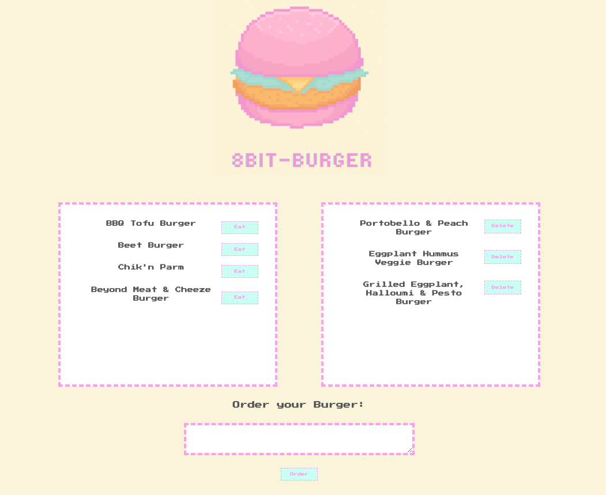

# Eat-Da-Burger

[](https://opensource.org/licenses/MIT)

## Description

An 8-Bit styled Burger Restaurant where users can order, eat, and delete burgers of their choosing.

## Table of Contents

- [Eat-Da-Burger](#eat-da-burger)
  - [Description](#description)
  - [Table of Contents](#table-of-contents)
  - [Usage](#usage)
  - [Built With](#built-with)
  - [License](#license)
  - [Contributing](#contributing)
  - [Testing](#testing)
  - [Contact](#contact)
  - [Acknowledgements](#acknowledgements)

## Usage

```
Eat-Da-Burger! is a restaurant app that lets users input the names of burgers they'd like to eat.

Whenever a user submits a burger's name, your app will display the burger on the left side of the page -- waiting to be devoured.

Each burger in the waiting area also has a `Devour it!` button. When the user clicks it, the burger will move to the right side of the page.

Your app will store every burger in a database, whether devoured or not.
```

View the deployed heroku application [here](https://sleepy-reaches-07786.herokuapp.com/).





## Built With

- node.js
- express
- express-handlebars
- mysql

## License

[MIT](LICENSE)

## Contributing

To contribute to this project create a branch with the feature or correction then submit a pull request.

## Testing

No tests have been created for this application at this time.

## Contact

Please direct any questions or concerns directly to me via my email address listed below.

- Github: [relizabet](https://github.com/relizabet)
- Email: rachel@relizabeth.com

## Acknowledgements

- Giphy Capture
- Canva
